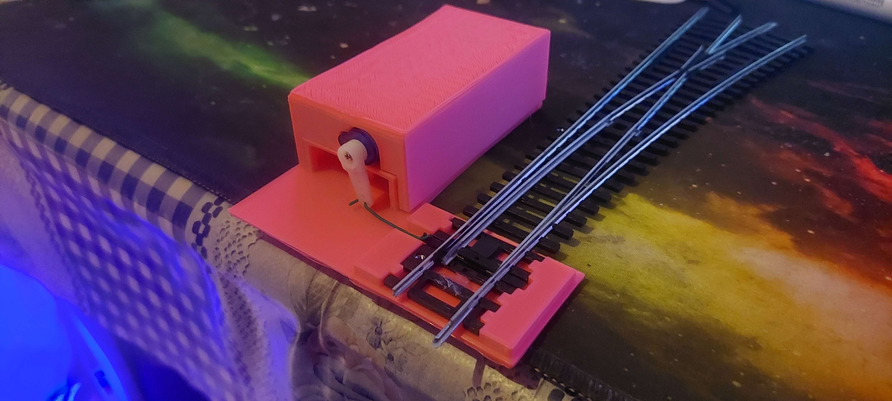
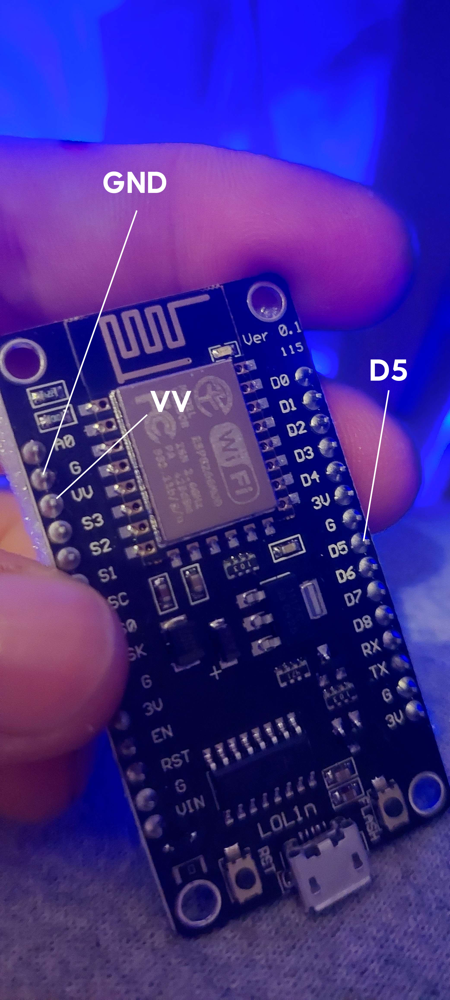
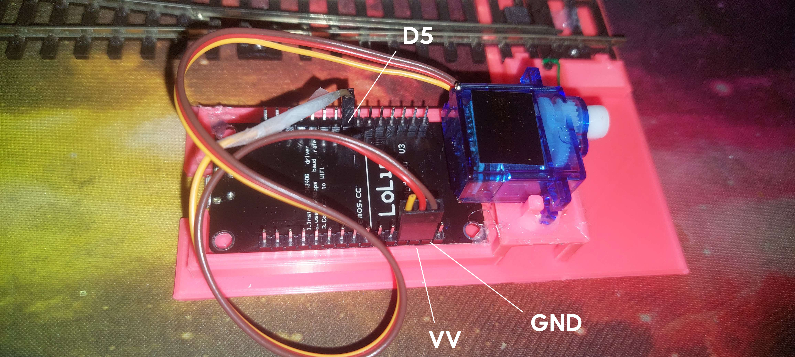
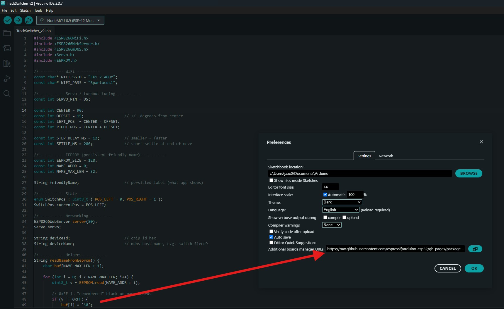
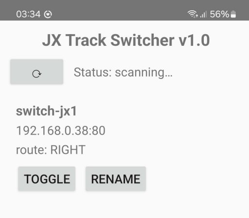
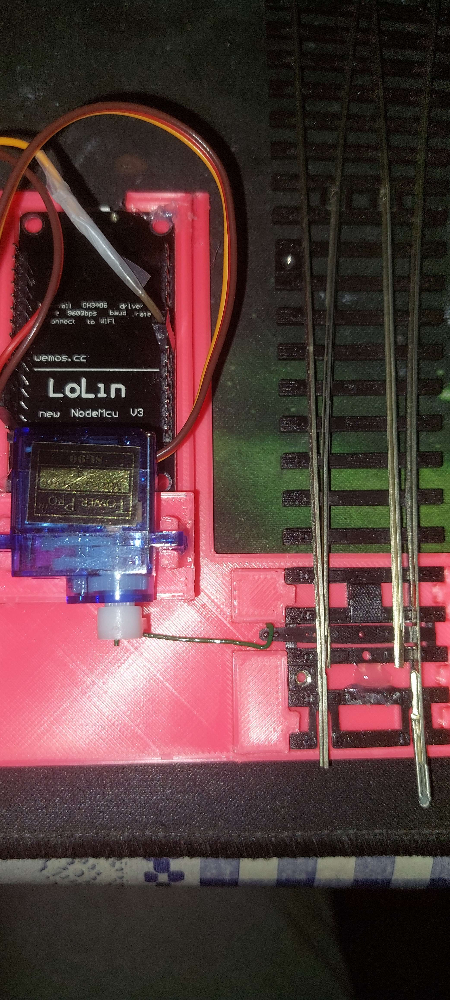
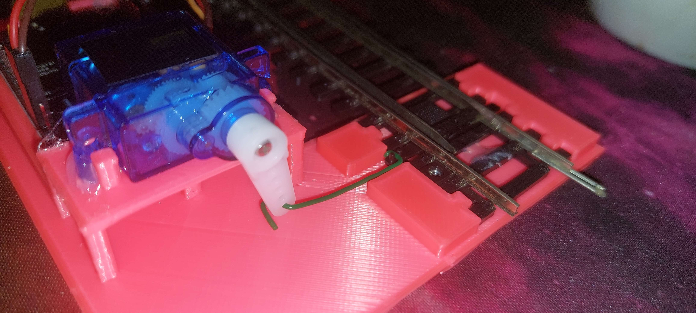
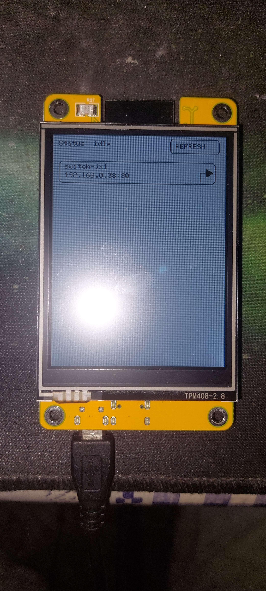

# 🚦 JX Track Switch System for H0 Piko Track Switch

This project is a WiFi-controlled model railway track switch system consisting of:

- a NodeMCU-based track switch (servo + WiFi)
- an Android app to discover and toggle switches
- an optional ESP32 touchscreen controller
- a 3D-printed enclosure to mount everything

## 📁 Repository Contents

TrackSwitcher_v2.ino  
Main firmware for the NodeMCU track switch

JXTrackSwitcher.apk  
Android manager app

TrackManager_Arduino.ino  
Optional ESP32 touchscreen manager

JX_H0_Track_Switch_3DPrint.zip  
3D-printable case (base + cover)

---

## 1️⃣ Track Switch

Each track switch consists of:

## 🧩 Required Parts

- NodeMCU (ESP8266) (dimensions: 60mm x 31mm)
- SG90 9g servo (dimensions: 23mm x 24.5mm)
- Dupont wire
- Hot glue
- Thin metal wire for servo → track linkage
- 3D-printed case (see zip file) 
- and probably the most important part.. a Piko switch track just like in the image (unless you are willing to edit the model to make another track fit...

---

## 🔌 Wiring

Servo → NodeMCU

You can just cut the Orange Servo wire at the end and use part of a dupont wire to bind it to D5 on the Nodemcu.

Brown → GND

Red → VV

Orange → D5 

IMPORTANT  
Use VV / 5V just like in the image, DO NOT USE VIN OR 3.3 otherwise you might fry your microcontroller.
If you have a multimeter measure the voltage, it must be 5V+ when the nodemcu is plugged in.

---

## 🧠 Firmware Setup (TrackSwitcher_v2.ino)

#### Step 1a: Install Arduino IDE
- Download and install Arduino IDE (2.3.7)
- https://www.arduino.cc/en/software

#### Step 1b: Add ESP8266 (NodeMCU) board support
1. Open Arduino IDE
2. Go to **File → Preferences**
3. In **Additional Boards Manager URLs**, add:
   
       https://arduino.esp8266.com/stable/package_esp8266com_index.json

5. Click **OK**
6. Go to **Tools → Board → Boards Manager**
7. Search for **esp8266**
8. Install **“esp8266 by ESP8266 Community”**

#### Step 1c: Select the correct board
1. Go to **Tools → Board**
2. Select **NodeMCU 1.0 (ESP-12E Module)** (or 0.9 if you have that)

#### Step 1d: Install required libraries
Go to **Tools → Manage Libraries** and install:

- **ESP8266WiFi** (usually installed automatically with the board)
- **ESP8266HTTPClient**
- **ESP8266mDNS**

Restart Arduino IDE after installing libraries.

#### Step 1e: Open the firmware
- Open `TrackSwitcher_v2.ino` in Arduino IDE

### Step 2: Set WiFi credentials
You must edit these lines before compiling:

    const char* WIFI_SSID = "YOUR_WIFI_NAME";
    const char* WIFI_PASS = "YOUR_WIFI_PASSWORD";

Each switch connects directly to your local WiFi.

### Step 3: Upload
- select the board (if not selected): NodeMCU 1.0 (ESP-12E Module)
- and the port: COM3 ? (the new one that shows up when you plug in the board)

---

## 📱 Android Manager App

Installation:

1. Copy JXTrackSwitcher.apk to your phone
2. Enable “Install unknown apps”
3. Install the APK

---

## 🔄 Initial Switch Calibration (IMPORTANT)

Before installing the mechanical linkage, do the following:

1. Power the NodeMCU with the uploaded firmware
2. Open the Android app
3. Let the app discover the switch
4. Toggle the switch twice  
   The final position must be diverging (right)
5. Confirm the servo arm is now positioned for the diverging (rightward) direction

## 🛠 Mechanical Assembly

1. 3D-print the base and cover
2. Place the NodeMCU and servo into the base
3. Hot glue both (just a tiny amount in the corners will suffice)
   Make sure NodeMCU USB port remains accessible
4. Place the track into the base just like in the image.. (hotglue is optional)
5. Attach the servo horn (in the bag that came with the servo there are several.. pick the one from the image)
6. Connect servo horn to the turnout
   Use a thin metal wire and bend it like in the image - use last hole of horn otherwise you have to calibrate the code..
   use two bends on each side of the wire..
   Install the linkage so that:
   - the track goes RIGHT (diverging)
   - the servo is already in the RIGHT position
8. Test movement  
   Toggle the switch from the Android app  
   Track must move cleanly between straight and diverging  
   Fine-tune linkage if needed

---

## 🖥 Optional: ESP32 Touchscreen Manager

This is an optional physical control panel.

Hardware:
- ESP32-2432S028R (2.8 inch TFT + touch)

Firmware:
- TrackManager_Arduino.ino

What it does:
- Connects to WiFi
- Discovers switches via mDNS
- Displays up to 8 switches
- Touch button toggles a switch
- Refresh button rescans the network

Notes:
- Requires TFT_eSPI and TFT_Touch libraries
- Touch calibration and rotation must be correct
- Some manual tweaking may be required depending on board revision

  

